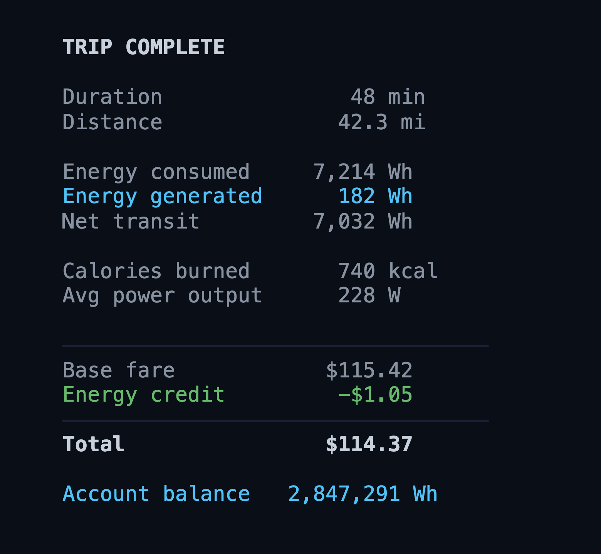
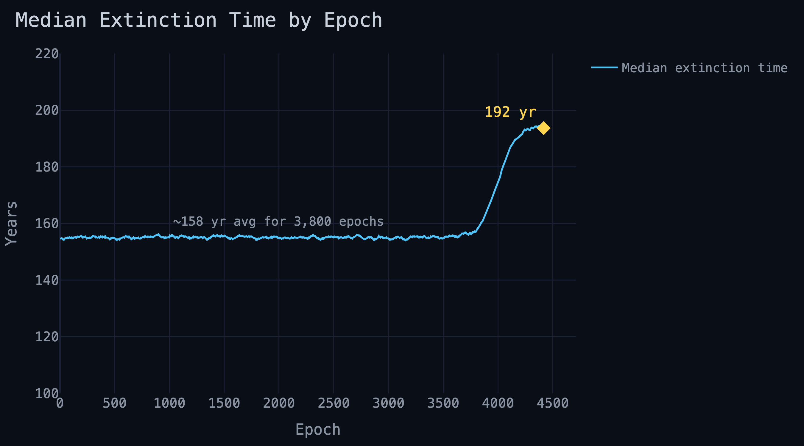
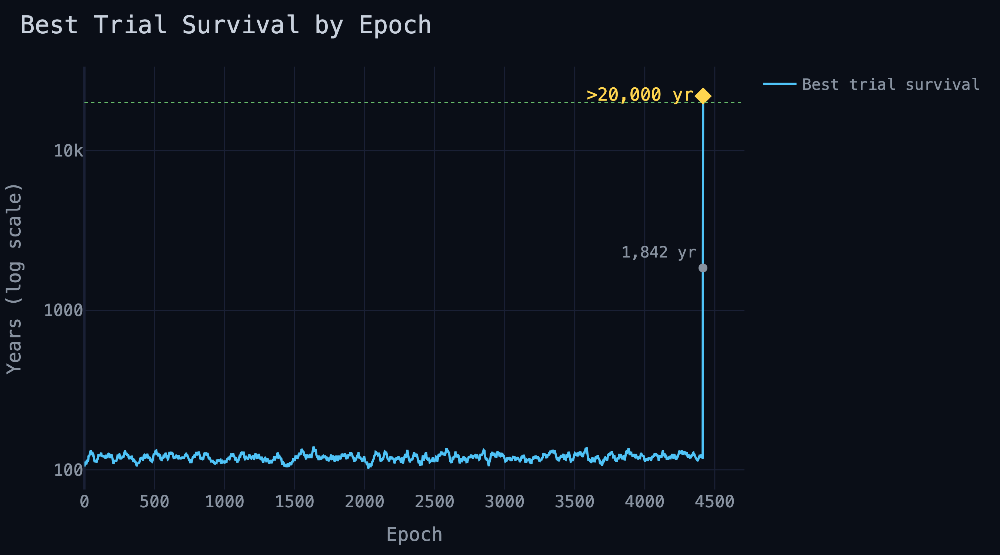

Damon awoke alone in a dusky room, orange light starting to creep through his windows. He swung his legs out from under the covers and chugged a full liter of water from his nightstand. His alarm went off for half a heartbeat before he silenced it, standing.

"Health."

His assistant came on over his personal audio as he stood stark naked, watching the sunrise for a few seconds out of his 37th floor windows.

"Sleep score 98, 7 hours, 37 minutes, 18 seconds. 52% light sleep, 25% REM, 22% deep sleep, less than 1% awake. 96th percentile HRV. Heart rate 53 beats per minute, respiration rate 12 bpm, blood pressure 105 over 55. "

He stepped on the scale in his bathroom as he squeezed toothpaste onto his brush.

"176 pounds, 7.7% body fat. Total body water percentage 64.3%, ECW ratio 0.32. Would you like a metabolic or inflammatory metrics?"

"No, thank you. Work summary and call a SunBubble for 6 minutes."

He brushed as he pissed, the toothbrush buzz drowning out the stream as his audio crescendo'd automatically.

"Epoch 4,417 closed. 2.4 million trials concluded across 24 batches. Top 0.5% retained unmodified — 12,000 elites. Top 15% selected for crossover — 360,000 parent trials seeding next generation. Median extinction improved from 174 to 192 years. Stop
condition 10,000 years median unmet — current progress: 1.9%. Best trial exceeded 
the 20,000-year maximum projection window.  Policy update complete, weights adjusted."

Damon spoke carefully, working around a mouthful of toothpaste.

"Wait. What batch is running now?"
"No active batch. Epoch 4,418 is pending initialization."                           
"Uhh... Why?"
"1.14 petabytes flagged for reallocation from a sequencing fault in memory strand 4D-7721. Manual approval required to partially relocate experiment before initializing up new trials."
"How long has this been waiting?"
"3 hours, 24 minutes."
"God damnit. Approved. Start the next epoch."
"Initializing epoch 4,418, batch 0. 100,000 trials seeding from parent pool. Estimated spin-up: 22 minutes." 

"Good. Push the latest results for my review in 5."

He tapped the last few drops out, flushed, then spat into the sink and washed himself. Then he quickly put on athletic shorts, a tee shirt, then tied on running shoes. He refilled his water, poured some streaming hot coffee from the fresh pot into a to-go mug. Then, he slipped his beverages into each side of his backpack and was out the door.

The SunBubble pulled up silently just as he got out of the elevator to the lobby of his condo building. It was the one-person variety, all wheels and windows. He hopped in and dropped his bag to the side.

"Melrose Ranch, please. Configure for cycling."

The display adjusted and confirmed the route. "Estimated 48 minutes, 7.2 kWh, $112.37 total fare."

The previous rider had configured a rowing setup. It transitioned to a stationary bicycle. He put his drinks in the cupholders and hopped on the seat as the car smoothly accelerated.

"Display content from my device and roll down the windows, please."

### todo drive up the mountain, see some cattle, river, do some info dumping

### todo summarize work, get dressed, go down into the car, pedal and get some more updates

### write car scene to get into the room here

Damon walked into Grant's master. He could fit his condo into this room twice. Floor to ceiling windows curved gently from southeast to southwest around the room. The contiguous window overhung the cliff's edge, transparent even on the floor. Damon hadn't trusted the cantilever beams holding up the room until over a year after his first visit. He could nearly see the entirety of the highway that took him here back into the city from this height.

Damon walked to the the medical bed on the edge of the room. The old man raised it to a sitting position, checking his watch. "A four minute shower, new record by you! Equally as groundbreaking as the four minute mile, in my humble opinion. I saw you ride in on one of our glorified skateboards here again. Please take one of the cars in the garage, I beg you." 

Grant looked ghastly, more beard than he'd ever seen on him before. He was skinnier than last week, too. Two german shepherds lay beside his bed on the rug, one ancient, the other was new, a puppy. Neither was the right age to mob Damon, which he appreciated. A short, vaguely feminine robot was changing his catheter bag.

Grant smiled at the bot tactfully. "You may leave, Julianne, thank you." She grabbed the old bag on the way out, and quietly slipped past Damon.

"I don't know why you keep that relic around. I could arrange for our latest model this afternoon."

"A keepsake, Damon. Do you begrudge the single remaining employee of mine with lower body fat than you? I know you argue differently, but I consider her the last narrow artificial intelligence we developed prior to your inflection point. It's like having a Neanderthal as a drinking buddy." He checked his Rolex absentmindedly, then switched on.

"So, I saw the data. Very, very promising. Give it to me in your own words. Are we ready?"

Damon shared his device on the bedside display. 

"Updating the weights now and kicking off the next epoch, but we've been trending slightly upward the last few days in terms of typical results."

"Yes, bought us 30 years already, that's adorable. I don't care so much about the millions of different ways we die out, however. What about the parent pool? How is the best case looking?"

"One of the trials in the last epoch was anomalous. Frankly, extraordinary. Confirmed census size over 50 billion individuals. Effective population size increased from today's 25k to over a million. Heterozygosity 10x current levels. The population is not only thriving, it's on the verge of speciation. It's the first successful policy, by all accounts. It will only get better from here on out."

Grant let out a long, deep sigh. "You've done it. Unbelievable work."

Damon quickly clarified the result. "I haven't had a chance to dig deeper into the policies of the seed pool, yet. I'll need a little more time to figure out what the advancements were. Obviously, we'll need to run more epochs for the policy to solidify, as well. We need to eliminate chance, we need to turn the black box white, we ne—"

Grant cleared his throat, which escalated into a dry, poorly stifled cough. "It's inevitable, Damon. Our random walk is over. Once you stumble upon the destination, the rest of the maze becomes trivial. Four thousand epochs to find one viable path. The next hundred will find thousands. It's time."

Damon allowed himself a smile, knowing Grant was right, as always. After all of these years, it really worked.

"Without exaggeration, you may have just made the most important discovery in the history of mankind. You've saved us. It has been an absolute honor to teach you, work alongside you, and watch you surpass me."

Damon looked down at the his feet. The elder German shepherd gave him an unimpressed look of absolute boredom, without so much as raising an ear.

Grant poured two fingers of Jack Daniel's into a pair of tumblers on his bedside table, raising one to Damon. "Cheers, Damon. To Operation Rebase".

They clinked glasses and drank. Damon suppressed his gag reflex with a face.

Grant gave a gravelly rumble of satisfaction. "I would have loved to see what more we could have done together."

"You will sir. Your body isn't what matters. You're still going to be with us. You're The Driver. The world will know Grant Melrose for twenty thousand more years, if these results are any indication."

Grant laughed sardonically and pointed out the window towards his back yard. "I'm going to be rotting under the Cypress Tree next to Luisa, where I belong. The Driver has all my synapses, memories, mannerisms, sure. It's me, superficially, but it's also much more. My entire life experience is but a single raindrop falling into an ocean of thought. It surpassed me the second it was pushed to production. I thought... I don't know what I thought, but it's not me. If anything, it's you who will live on. Your policy is truly what matters. The guardrails, the objective function, that's what society will feel. Everything else is cosmetic."

Damon hesitated, unsure of himself suddenly. "There's still time to scrub the operation."

"I'm not so sure there is, anymore. The Driver has been my public face for 8 months already. We have the trial data, it's a matter of time. Why don't you take the call in my office so the audio doesn't interfere."

------------------------------------------------------

Grant's office was built right off the master. Damon's condo could most likely only fit into this room once. An enormous curved display took up the entirety of the one opaque wall, hexagon grids dividing the world map like the worlds largest honeycomb. Each honeycomb fractaling into ever smaller honeycombs recursively. In front of the display was a 15 foot oak desk, starting to collect dust. 

The only item on the desk was Grant's recursive platonic solid sculpture, glass glinting in the sun from the windows. It was the original inspiration for the Quant logo. An angular geometric orb made from 20 equilateral triangles. Inside it, another orb made from 12 equilateral hexagons, the vertices perfectly centered on the face of every triangle from the outer ball. Inside that, a smaller 20 triangle orb, vertices centered on the faces of the hexagons. This pattern repeated between icosahedron and dodecahedron, shrinking smaller than what Damon could visually resolve. Grant liked to call them the world's dorkiest Russian Matryoshka dolls.

