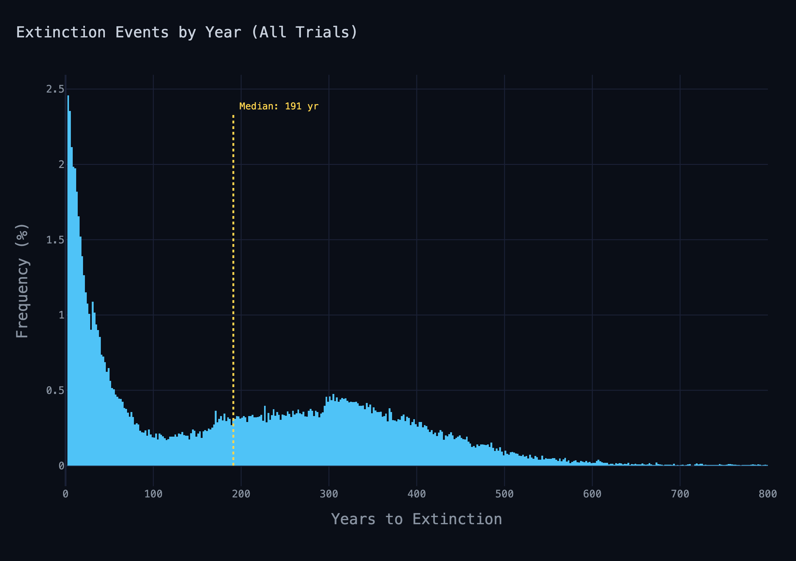
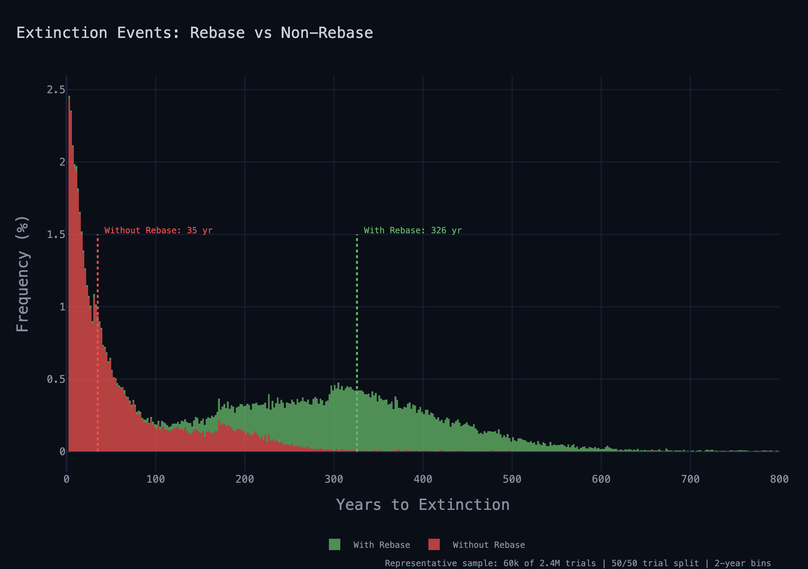
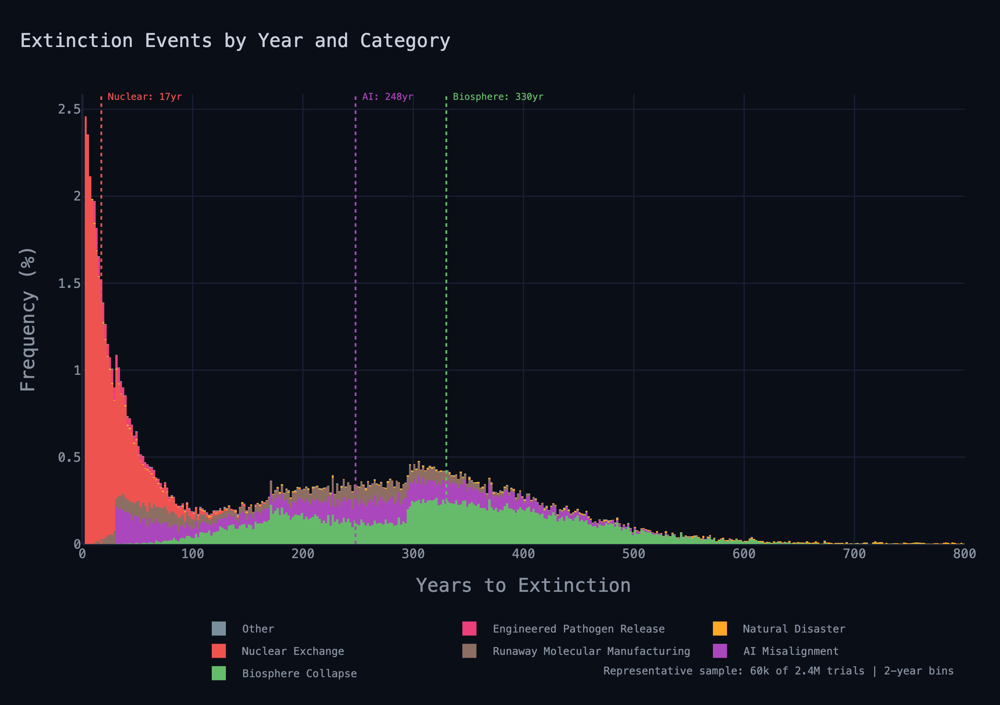
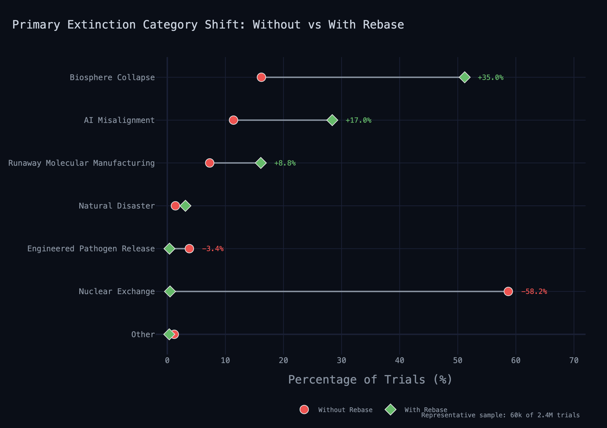
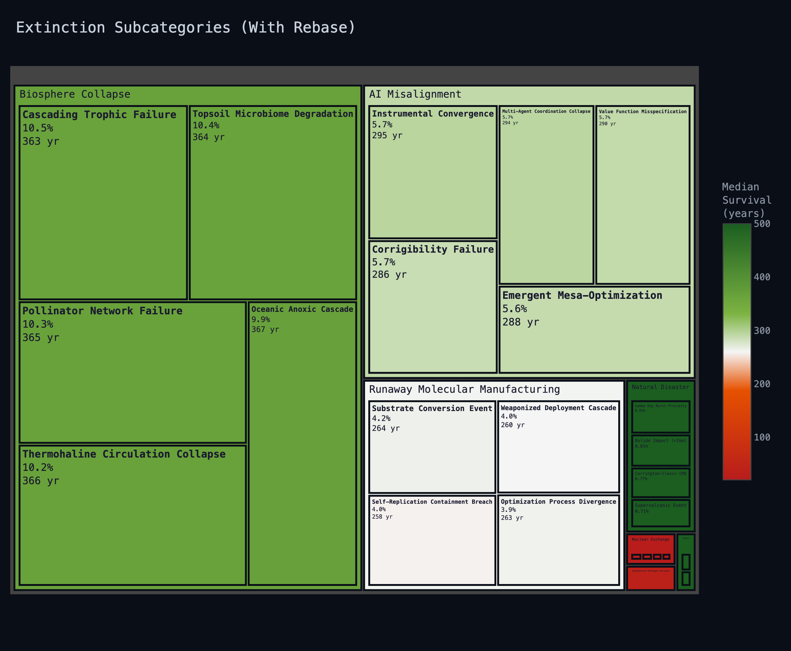

*December, 2041*
*Sedona, Arizona, United States of America*

Damon awoke alone in a dusky room, orange light starting to creep through his windows. He swung his legs out from under the covers and chugged a full liter of water from his nightstand. His alarm went off for half a heartbeat before he silenced it, standing.

"Health."

His assistant came on over his personal audio as he stood stark naked, watching the sunrise for a few seconds out of his 10th floor windows.

"Sleep score 98, 7 hours, 37 minutes, 18 seconds. 52% light sleep, 25% REM, 22% deep sleep, less than 1% awake. 96th percentile HRV. Heart rate 53 beats per minute, respiration rate 12 bpm, blood pressure 105 over 55. "

He stood at the sink as he squeezed toothpaste onto his brush.

"176 pounds, 7.7% body fat. Total body water percentage 64.3%, ECW ratio 0.32. Would you like metabolic or inflammatory metrics?"

"No, thank you. Work summary and call a SunBubble for 6 minutes."

He brushed as he pissed, the toothbrush buzz drowning out the stream as his audio crescendoed automatically.

"Epoch 4,417 closed. 2.4 million trials concluded across 24 batches. Top 0.5% retained unmodified — 12,000 elites. Top 15% selected for crossover — 360,000 parent trials seeding next generation. Median extinction improved from 174 to 192 years. Stop condition 10,000 years median unmet — current progress: 1.9%. Best trial exceeded the 20,000-year maximum projection window. Policy update complete, weights adjusted."

Damon spoke carefully, working around a mouthful of toothpaste.

"Wait. What batch is running now?"
"No active batch. Epoch 4,418 is pending initialization."                           
"Uhh... Why?"
"1.14 petabytes flagged for reallocation from a sequencing fault in memory strand 4D-7721. Manual approval required to partially relocate experiment before initializing up new trials."
"How long has this been waiting?"
"3 hours, 24 minutes."
"God damnit. Approved. Start the next epoch."
"Initializing epoch 4,418, batch 0. 100,000 trials seeding from parent pool. Estimated spin-up: 22 minutes." 

"Good. Push the latest weights to prod, then summarize the experimental results for my review in 5."

He tapped the last few drops out, flushed, spat into the sink and washed himself. Athletic shorts, a tee shirt, running shoes. He refilled his water, poured steaming hot coffee from the fresh pot into a to-go mug, slipped both into his backpack, and was out the door.

The SunBubble pulled up silently just as he got out of the elevator to the lobby of his condo building. It was the one-person variety, all wheels and windows. He hopped in and dropped his bag to the side.

"Melrose Ranch, please. Configure for cycling."

The display adjusted and confirmed the route. "Estimated 48 minutes, 7.2 kWh, $112.37 total fare."

The previous rider had configured a rowing setup. It transitioned to a stationary bicycle. He put his drinks in the cupholders and hopped on the seat as the car smoothly accelerated.

"Random variation to cycling resistance at minutely intervals, please. Display the survival distribution from my device and roll down the windows, please. "

The SunBubble display dutifully streamed the content from his device, but the audio was his assistant's.

"Median survival has climbed to 192–"
"Yes, split the distribution by Operation Rebase for me, please."

The assistant continued. "Without rebase, short term extinction scenarios are much more dominant. Higher variance in the rebase scenarios, and a longer average outcome."
Damon stood off his seat as the resistance increased on the cycle. "Show me the distribution by primary cause of extinction. Give me the delta between extinction scenario rates for rebase and non-rebase in a dumbbell plot, as well."

"Notably, biosphere collapse, AI misalignment, and natural disaster rate went–"
"That's all survivorship bias. The short term risks are no longer present. Give me cause subcategory rates with median outcome in a treemap, just for the rebase scenarios. Any significant changes in the rates in the latest epoch?"

"There's no statistically significant change to the rates from epoch 4,416 to 4,417." His assistant replied dutifully.
Damon's eyes lingered for a few seconds, before he redirected the agent. "Great. Deep dive on the results of the best trial, I want to start reviewing the white paper in 15 minutes. Switch audio to music"
He let his mind empty all conscious thought with the air blowing his hair and the constant rhythm of his pumping legs for a long while.

-----------------------------------

Damon's thighs were starting to burn, and his shirt was soaked. His bpm was at 163, with 52 breaths per minute. Sweat was collecting in a puddle on the floor directly beneath his chin. The car turned off the main highway and began a gradual ascent. It passed security fencing, then a few miles later crossed the Verde River Bridge. The water was low today. He loved this part of the drive. 

As the car switched back and forth up the ever increasing slope, it crested a ridge and Damon could see a large drove of cattle down in the valley, thousands of them milling about the river. The musky smell of the animals hit him hard, even from a great distance. Damon tried counting a section of the herd and gave up at a hundred. For all the acreage Grant had sunk into his re-wilding project, Damon had never seen more than a few dozen on the commute. The animals were free to roam as they pleased. Ultimately, they were still penned in, but did it really matter if they'd never notice the fence?

As he retreated up the mountain the individual cattle began to blur into points. Motion propagated through the herd in ripples. Damon thought they looked less like animals than particles bumping randomly into each other. They transferred their kinetic energy through to the neighboring animals in waves, like air flowing over a wing in a wind tunnel. The flow was laminar where the crowd was more dense–fast and orderly. It was turbulent and chaotic in more sparse areas.

He hit 180 watt hours of generation on his ride and his device buzzed. He checked his watch as he spun down, 168 bpm, 55 breaths per minute. He coasted down for a few minutes, alternating small sips of water and coffee. He monitored his heart rate until it was down under 100. Uniform solar arrays whipped past his windows

One last switchback and they pulled up to the Melrose Ranch. It was a bit of a misnomer at this altitude — compound, maybe, or lair. The underground parking garage door opened as the SunBubble approached. It drove right up to the locker room entrance, past dozens of high end vehicles Damon couldn't name if his life depended on it. He grabbed his bag and glanced at the receipt — 7.2 kilowatt-hours consumed, 0.18 offset by pedaling, $109.14 net. Fifteen bucks a kilowatt-hour to ride in a glass box up a mountain. At least he saved three dollars.

Damon threw his sopping clothes into the hamper and walked into the wet room. He quickly showered, then changed at his locker into jeans and a hoodie. He rode the elevator up and grabbed a second coffee from Grant's kitchen, along with a banana. He half-jogged through the main level past a dozen identical taxidermy dogs running in the same direction to get to the far end of the house.

He could fit his condo into Grant's master bedroom twice. Floor to ceiling windows curved gently from southeast to southwest around the room. The window overhung the cliff's edge, transparent even on the floor. Damon hadn't trusted walking out over the edge until over a year after his first visit. He could nearly see the entirety of the highway that took him here back into the city from this height.

Damon walked towards the medical bed in the corner. The old man raised it to a sitting position, checking his watch. "A four minute shower, new record by you! Equally as impressive a barrier as the four minute mile, in my humble opinion. I saw you ride in on one of our glorified skateboards here again. Please take one of the cars in the garage, I beg you." 

Grant looked ghastly, more beard than he'd ever seen on him before. He was noticeably skinnier from just a week ago. Two german shepherds lay beside his bed on the rug, one ancient, the other was new, a puppy. Neither was of the age to mob Damon, which he appreciated. A short, vaguely feminine robot was changing his catheter bag.

Damon went to the window to see if the herd was visible from this vantage. "I think I saw every cow you own down in the valley today, I've never seen so many before."

Grant puffed up a bit. "Glad to hear it. I'm hoping to see some of my bison make the trek down here soon, too. You know, this ranch is more than 100 million acres. It contains more–"
"Contiguous land than all of the national parks in the states combined, yes." Damon finished the sentence for him.
Grant smiled at that, then addressed the bot tactfully. "You may leave, Julianne, thank you." She grabbed the old bag on the way out, and quietly slipped past Damon.

"I don't know why you keep that relic around. I could arrange for our latest model this afternoon."

"A keepsake, Damon. Do you begrudge the single remaining employee of mine with lower body fat than you? I know you argue differently, but I consider her the last narrow artificial intelligence we developed prior to your inflection point. It's like having a Neanderthal as a drinking buddy." He checked his Rolex absentmindedly, then switched on.

"So, I saw the data. Very, very promising. Give it to me in your own words. Are we ready?"

Damon shared content from his device on the bedside display. 

"Updating the weights now and kicking off the next epoch, but we've been trending slightly upward the last few days in terms of the typical trial outcome."

"Yes, bought us 30 years already, that's adorable. I don't care so much about the millions of different ways we die out, however. What about the parent pool? How is the best case looking?"

"Well, technically, filtering for rebase it's more like a 290 year improvement. As for the best case, one of the trials in the last epoch was anomalous. Frankly, extraordinary. Confirmed census size over 50 billion individuals. Effective population size increased from today's 25k to over a million. Heterozygosity 10x current levels. The population is not only thriving, it's on the verge of speciation. It's the first successful policy, by all accounts. It will only get better from here on out."

Grant closed his eyes and let out a long, deep sigh. "So it's done then. Unbelievable work. I care a lot less about you blowing through our quarterly compute budget this week."

Damon quickly clarified the result. "I haven't had a chance to dig deeper into the policies of the seed pool, yet. I mean, it's safe to remove non-rebase scenarios from the search space, but I'll need a little more time to figure out what the specific advancements were. Obviously, we'll need to run more epochs for the policy to solidify, as well. We need to eliminate chance, we need to turn the black box white, we ne—"

Grant cleared his throat, which escalated into a dry, poorly stifled cough. "It's inevitable, Damon. Our random walk is over. Once you stumble upon the light switch, the rest of the maze becomes trivial. Four thousand epochs to find one viable path. The next hundred will find thousands. It's time."

Damon allowed himself a smile, knowing Grant was right, as always. He'd banged his head against the wall for so many years, it was hard to believe this was it.

"Without exaggeration, you may have just made the most important advancement in the history of mankind. You've saved us. It has been an absolute honor to teach you, work alongside you as a peer, then watch you surpass me."

Damon looked down at his feet. The elder German shepherd held his gaze radiating unmitigated boredom, without raising an ear.

Grant poured two fingers of Jack Daniel's into a pair of tumblers on his bedside table, raising one to Damon. "Cheers, Damon. To you, and to Operation Rebase."

They clinked glasses and drank. Damon suppressed his gag with a face.

Grant gave a gravelly rumble of satisfaction. "I would have loved to see what more we could have done together."

"You will, sir. You've said it yourself, the body is merely a temporary vessel. You're still going to be with us. You're Honeycomb. The world will know Grant Melrose for twenty thousand more years, if these results are any indication."

Grant laughed sardonically and pointed out the window towards his back yard. "I'm going to be rotting under the Cypress Tree next to Luisa, where I belong. Honeycomb has all my synapses, memories, mannerisms, sure. It's me, superficially, but it's much, much more. My entire life experience is but a single raindrop rippling into an ocean of thought. It surpassed me the second it was pushed to production. I thought... I don't know what I thought, but it's not me, and never was. I know that now, at least. If anything, it's you who will live on. Your policy is truly what matters. The guardrails, the objective function, that's what society will feel. The name, the speeches, everything else is cosmetic."

Damon hesitated, unsure of himself suddenly. "There's still time to scrub the operation, if you've reconsidered."

"I couldn't stop it even if I wanted to at this point, Damon. Honeycomb has been my public face for 8 months. The horse has left the barn. Now that we have your experiment data, it's inexorable. Besides, the exchange raised the stakes a bit, Honeycomb issued the order an hour ago."

He poured himself another glass of whiskey, more like four fingers this time. He didn't think to offer the same to Damon.

"Why don't you join the call? You should be there. Take it in my office so the audio doesn't interfere?"

------------------------------------------------------

Grant's office was built right off the master. Damon's condo could most likely only fit into this room once. An enormous curved display took up the entirety of the one opaque wall. On it there were 5 globes, hexagon grids wrapping each world map like a mesh net. Each honeycomb subdivided into smaller honeycombs recursively. In front of the display was a 15 foot black desk. Damon knew it to be African Blackwood via Grant, but he suspected that might just be a fancy name for ebony. Damon sat down, sweeping dust clear to make room for his workstation.

The only other item on the desk was a glass sculpture the size of a child's basketball, refracting the sun into a dozen spectra across the ebony. It was made of nested shells — an outer cage of twenty triangles containing a shell of twelve pentagons, containing a smaller cage of twenty triangles, containing twelve smaller pentagons, on and on, each layer perfectly seated inside the last, alternating geometries all the way down past what the eye could follow. Grant had commissioned it decades ago. It was the original inspiration for the Quant logo, and Grant's favorite conversation piece. He liked to call it his "Russian Mashdorka Doll set."

Damon logged on, put on his headset and opened the video conferencing link. He was pulled into a virtual command center — tiered rows of workstations facing a wall of main displays, each station bristling with its own array of panels. The largest of the main displays had the same five globes he had seen in Grant's real-life office. Grant was already in the space in a full suit. He beamed at the head of the director's console. Or, at least this version of him did. He was clean shaven, looking 10 years younger.

"Welcome, Damon. Amazing work on the latest epoch. The white paper is nothing short of extraordinary."

Damon heard the real Grant hacking up a lung a few feet away leaking through his headset. He isolated his audio to focus on the meeting. "Thank you, sir."

Nearly a hundred people filled the virtual command center, chiming as they materialized out of thin air. A dozen heads of state joined like it was a daily stand up call. United States, Russia, China, Japan, England, France, Canada, Brazil, it seemed the entire UN and more had representation. A handful of suits from each of the former FAANG companies, accompanied by engineers at the workstations. Logistics, telecommunication, energy, defense contractors, financial institutions were all represented. He recognized the logos on most of the avatars but he was ashamed to admit that he didn't know the names of the majority of the people on the call. This was not his world. He remembered with profound shame that he was wearing a hoodie.

"It's 0900, let's get to it. T-minus 2 minutes. Recording in progress." Grant took charge of the room instantly.

The engineers were frantically tabbing between screens, no doubt quadruple checking last minute adjustments. Low chatter filled the room. Each globe was labeled with a phase. He was reading the checklists under each phase when Grant raised his hand to silence the floor.

"Thank you to all who have worked tirelessly for the past 11 years to make today a reality, both in the public and private sector. I know I'm not the only one in this room who can say that this is their life's work. I'll see you all on the other side."

The alarm beeped three times, clinically. A progress bar appeared: 1%. Five globes, five phases, each labeled on the display.

The first globe started filling in from grey. *Communications.* Hexagons blinked to green in small chunks, like sections of a grid restoring power after a blackout. They radiated outward from city to city. Damon's personal device and watch buzzed, then went black. The room lagged for half a second, overcorrected, then stabilized — like a refresh rate catching up to itself.

The second globe was already chasing the first. *Command and Control.* Military command centers, SCADA systems, classified networks. The phases weren't sequential — they were cascading. Ten seconds in and both globes were nearly solid green. Teams were talking over each other on their headsets, the room growing louder.

*Critical Infrastructure.* The third globe was filling before he finished reading the checklist. Damon wondered how many people just lost power, water, and gas. It was Monday at 9am in the US. How many planes were in the air right now? 25,000? 

*Financial Systems.* A few hexagons stayed black on the earlier globes — Korea, sub-Saharan Africa, scattered spots. The fourth globe didn't care. The whole world blinked green nearly instantly. How was he going to get home? Surely they would let him keep his savings, no?

*Data and Cloud.* The fifth globe flipped faster than the fourth. Grant's hostile takeover of his three biggest compute competitors likely made that easier than the rest.

A few grey hexagons remained, but the tense buzz had settled into something more congratulatory. The occasional hex still blinked green. The whole thing had taken less than 30 seconds.

The progress bar read 94%. The label had changed to *Phase 6*. There wasn't a sixth globe.

Damon heard murmurs — others had noticed too. Then a thud. A man beside him had collapsed. Damon started toward him and he vanished. Another thud. He looked up. A dozen bodies dropped hard to the ground, then disappeared. He looked to Grant, who was laser focused on his terminal as if nobody else was in the room. Voices swelled and the elation was being swept away by panic in the room.

Damon threw his headset off and he was back in Grant's office. He shoved his device across the desk. His watch buzzed against his wrist — he clawed it off like it had bitten him and left it where it fell.

Grant was coughing in the next room. Damon stood and walked toward the bedroom. He made it three steps before he realized his jeans were soaked. He'd pissed himself and hadn't noticed.

Grant was snoring wheezily, asleep. Julianne was back, fussing over his IV.

How much had Grant slept through?

He saw Grant's device cut to an emergency screen with color bars, then switch to a video feed of Honeycomb, surrounded by the various heads of state in an official looking office.

---

**To the people of Earth,**

At **06:13 UTC** this morning, nuclear warheads detonated over Islamabad and Lahore.

Retaliatory strikes were intercepted before escalation. The exchange lasted under ten minutes. Preliminary casualties exceed two million.

This was not a hypothetical. This was today.

---

Effective immediately, all national borders are dissolved.

This action has been **formally approved or consented to by all 195 recognized governments**, through emergency authorities, constitutional delegations, and continuity provisions long prepared for but never expected to be used.

This is not conquest. This is not occupation. This is alignment.

Administrative authority is transferred to **Honeycomb** — the planetary governance system responsible for policy execution, coordination, and enforcement. A transitional board of global leaders will remain in place for oversight during the initial phase.

All strategic weapons systems are placed under a single unified defense framework. Political borders are replaced with **purely geographic addressing** using the **H3 hierarchical hexagonal grid**. All governing policy exists as **open-source code**, versioned and auditable in real time.

---

This morning was not a failure. It was an inevitability — the expected output of 195 sovereign systems sharing one planet with no shared specification.

That codebase is deprecated. We do not patch. We do not merge. We start clean.

Questions are expected. Dissent is protected. As of today, there are no Americans, no Pakistanis, no Indians. Your nationality is your species.

There are citizens of Earth. Welcome home.
